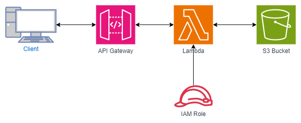

# 20240608-jawsug-kanazawa-cdk-workshop  
  
## はじめに  
このドキュメントは2024/06/08(土) 開催の「[JAWS-UG金沢 #99 CDKワークショップやってみよう](https://jawsug-kanazawa.doorkeeper.jp/events/172615)」の手順書になります。  
  
## 参考資料  
  
- [AWS CDKの開始方法(AWS公式ドキュメント)](https://docs.aws.amazon.com/ja_jp/cdk/v2/guide/getting_started.html)
- [AWS CDKを始めるハンズオン ─ IaCの第一歩をAWS LambdaDynamoDBのシンプルな仕組みで学ぶ(AWS 吉川さんのブログ)](https://en-ambi.com/itcontents/entry/2023/04/27/093000/)  


## 目次  
  
1. 事前準備  
1. 今回作成する構成  
1. AWS Lambdaの作成  
1. AWSにデプロイする
1. S3バケットの作成  
1. IAMポリシー＆ロールの作成  
1. IGrantable メソッドの利用
1. API Gatewayの作成
1. 後片付け
  
## 事前準備  
今回のCDKワークショップでは、下記が必要になります。  
  
- AWS CDK v2
- AWS CLI v2
- Node.js
- TypeScript
  
AWS CDK v2及びAWS CLI v2については、下記AWS公式ドキュメントを参考にインストールしてください。(分からない点があれば聞いてください)

[AWS CDKの開始方法(AWS公式ドキュメント)](https://docs.aws.amazon.com/ja_jp/cdk/v2/guide/getting_started.html)
  
なお上記公式ドキュメントでは ```npm -g install typescript``` コマンドでTypeScriptをグルーバルインストールしていますが、今回は不要です。(```npm install``` でローカルインストールする)
  
またNode.jsについては、自分のPCにインストールされていない場合、[Node.js公式サイト](https://nodejs.org/en/download/package-manager) を参考に、v22(Current)のインストールを行ってください。(インストール済みの場合、新たにインストールする必要はありません。)

TODO: bootstrapについて記載

### 言語について  
今回のワークショップでは、言語はTypeScriptを使用します。  
  
AWS CDKを記載する場合、言語はTypeScriptで記載する事が多いですが、実際には下記言語をサポートしています。  
  
- TypeScript
- JavaScript
- Python
- Java
- C#
- Go
  
ちなみに、どの言語を使用する場合でも(TypeScriptやJavaScript以外を使用する場合でも)、Node.jsのインストールは必要です。

### 今回作成する構成  
今回最終的に作成する構成は、下図の通りです。  
  

  
a
